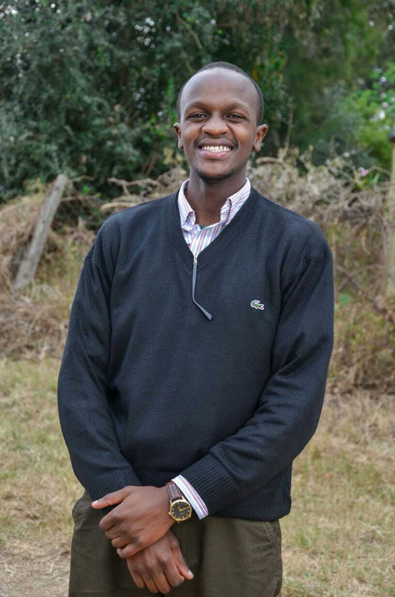

# MTAA
#### {Neighbourhood Connection}, {2018}
## Description

In today's world, people are less in touch with community members. The Mtaa platform is the best way to stay informed about what’s going on in your neighbourhood; whether it’s finding a last-minute person to watch your kids, planning a local event, sharing growth development ideas or sharing safety tips. There are so many ways your Neighbours can help, all you need is an easier way to connect with them.

## Setup/Installation Requirements

To run this project on your local machine, simply download it navigate to the folder and open the index.html file with any web browser(preferably chrome).

## BEHAVIOR
 * The user will be able to access different tabs on the home page.
 * On home page, the user will be also be able to have an overview of both previous and upcoming events. However, one must be a member to view all the details.
 * To be a member, one must sign up then log in
 * As a member, the user will be able to view the gallery , current posted events and post their own event.
 * On About page, the user will get more information on the page as well as meet the team behind the website.
 * The contact page will allow the user to send their feedback to the team.

## Technologies Used
Software used in the application include;
* IDEs include : Atom, VS Code, Brackets.
* Browsers include: Google Chrome, Mozilla Firefox.
* Hyper Text Markup Language
* Cascading Style Sheet
* JavaScript
* JQuery
* JavaScript plugin (FileSaver)
* Node.js
* Node Package Manager

## Support and contact details
* [Francis T](https://github.com/Fkaragu)
* [Loise W](https://github.com/tc-mwangi/)
* [Duncan N](https://github.com/Dun-Njuguna/)
* [Wakarima M](https://github.com/MargaretW/)
* [Chrispus N](https://github.com/Slim95Chrisp)

## Link to live page

[Preview](https://tc-mwangi.github.io/mtaa/)

## List of contributors
Thank you to all the people who made this happen:

| [ <b>Francis Thande</b>](https://github.com/Fkaragu)   | [ <b>Loise Mwangi</b>](https://github.com/tc-mwangi/)   | [ <b>Duncan Njuguna</b>](https://github.com/Dun-Njuguna/)  |
| :--- | :---: | ---: |
| [ <b>Wakarima M</b>](https://github.com/MargaretW/)   | [ <b>Chrispus Ngure</b>](https://github.com/Slim95Chrisp)

### License

Copyright (c) {2018} {Mtaa Inc} Permission is hereby granted, free of charge, to any person willing to obtain a copy of this program for personal use. However if the program will be used for commercial gain then a royalty fee will have to be paid to the author of the program.
